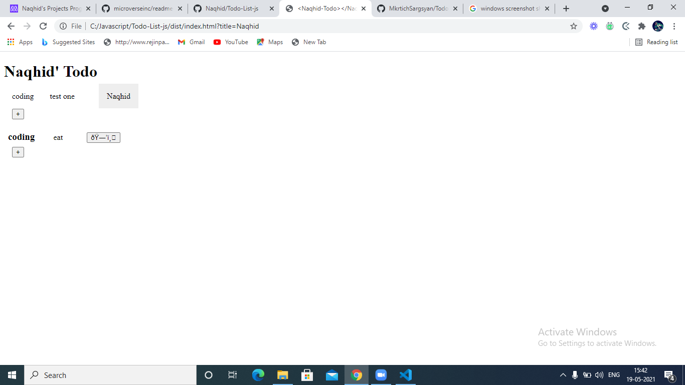

# Todo

A todo app for The Odin Project's javascript exercise

## Desktop

## Built With

- HTML
- CSS
- JavaScript
- css
- Webpack

## Getting Started

To get a local copy up and running follow these simple example steps.

### Setup

- Clone repository
- Open index.html

👤 **Mohammed Naqhid**

- GitHub: [@Naqhid](https://github.com/Naqhid)s
- Twitter: [Naqhid](https://twitter.com/naqhid)
- LinkedIn: [Naqhid](https://www.linkedin.com/in/mohammed-naqhid-ab3080189/)
- Email: mnaqhid@gmail.com

## Show your support

Give a ⭐️ if you like this project!
